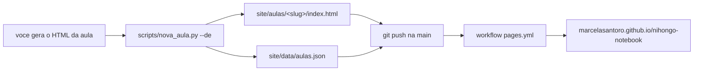

# Architecture

Caderno de estudo de japones. Uma pagina HTML por aula, publicada como site
estatico no GitHub Pages. Sem backend, sem build, sem dependencia de runtime.

O padrao vem de dois repositorios internos da Bayer,
`Apresentacoes_Enrico_Tucunduva` (principal) e `CPQ_Materials`: `site/` e a
fonte da verdade e e exatamente o que fica no ar, cada pagina e autocontida, e a
publicacao acontece por `git push`. A troca aqui e o destino, que passou de S3
interno para GitHub Pages.

## 1. Fluxo



O passo que gera o HTML da aula fica fora deste repositorio de proposito. O
caderno nao tem opiniao sobre como a aula virou HTML, so sobre o que o arquivo
precisa ter quando chega. Esse minimo esta em [CONTRATO-AULA.md](CONTRATO-AULA.md).

## 2. Estrutura

```
site/                        publicado como esta, sem build
  index.html                 hub, autocontido (CSS e JS inline)
  aulas/<slug>/index.html    uma pasta por aula, o arquivo e seu
  assets/
    js/pronuncia.js          botao de ouvir, compartilhado entre as aulas
    css/aula.css             folha opcional das aulas
    audio/                   MP3 de pronuncia + audio.json (o mapa texto -> arquivo)
    brand/favicon.svg
  data/aulas.json            indice da listagem
scripts/nova_aula.py         importa a aula e escreve no indice
docs/
  architecture.md            este arquivo
  CONTRATO-AULA.md           o que o HTML da aula precisa ter
.cursor/rules/aulas.mdc      convencoes, lidas pelo editor de IA
.github/workflows/pages.yml  publica site/ a cada push na main
ingest/                      git-ignored, material bruto da aula
```

## 3. Como o som e resolvido

Esta e a parte que exige decisao, porque nenhum dos caminhos disponiveis
funciona sozinho em toda maquina. `pronuncia.js` tenta tres, em ordem:

| # | Caminho | Vantagem | Limite |
| --- | --- | --- | --- |
| 1 | arquivo em `assets/audio/` | som real, identico em todo aparelho | alguem precisa gravar ou baixar o arquivo |
| 2 | voz japonesa do sistema (`speechSynthesis`) | zero arquivo, pronuncia correta | o Windows **nao** vem com voz japonesa instalada |
| 3 | aproximacao em grafia portuguesa, voz pt-BR | funciona em qualquer maquina | e aproximacao, nao japones |

O ponto 2 e a armadilha. Uma aula que so usa `speechSynthesis` parece funcionar
na maquina de quem a escreveu e cai em silencio, ou em romaji lido com sotaque,
na maquina de quem nao tem o pacote de idioma japones. Nao da para detectar isso
lendo o codigo — so aparece no uso.

Por isso o passo 3 existe e por isso ele **se identifica**: o botao vira
`≈ aproximação`, com outra cor, e a pagina mostra uma faixa dizendo o que esta
acontecendo e como instalar a voz japonesa. Uma aproximacao silenciosa ensinaria
pronuncia errada sem avisar, que num caderno de estudo e pior do que nao tocar
nada. Quando nao ha arquivo, nem voz, nem kana para aproximar (kanji solto), o
botao nao chega a ser criado.

O `audio.json` existe para dar som real a uma aula **ja publicada** sem reeditar
o HTML dela: e um mapa de texto japones para nome de arquivo, lido em runtime.
Como as aulas chegam prontas de fora, poder melhorar o audio sem voltar ao
gerador original importa mais aqui do que num site onde o mesmo autor escreve
tudo.

## 4. Decisoes e o porque

**A grafia portuguesa e um de-para por silaba, nao regex sobre a string.**
A primeira versao encadeava substituicoes na string inteira e uma troca comia a
anterior: `chi` virava `tchi`, que ainda contem `hi`, que a regra do ha-gyo
transformava de novo — `こんにちは` saia como `cônnitclila`. Quebrar em silabas
primeiro faz cada uma se traduzir uma vez e acabou.

As escolhas de grafia tem motivo fonetico, nao estetico: ha-gyo vira `rr` porque
o RR do portugues e o mesmo /h/ do japones; ra-gyo vira `l` porque o L fica mais
perto do tepe japones do que o R inicial, que sairia /h/ e trocaria ら por は;
sa-gyo vira `ss` porque S entre vogais em portugues vira /z/ (`asa`).

**Katakana nao tem tabela propria.** Ele ocupa o mesmo bloco Unicode do hiragana
deslocado de `0x60`, entao converter na entrada evita duas tabelas saindo de
sincronia.

**A pasta de audio sai de `import.meta.url`, nao do endereco da pagina.** Assim o
caminho continua certo em qualquer nivel de subpasta e sobrevive a uma mudanca no
endereco do site. A licao veio do `CPQ_Materials`, que resolve a URL do worker do
mesmo jeito e pelo mesmo motivo.

**O indice e um JSON versionado, nao uma varredura de pastas.** Um site estatico
nao consegue listar um diretorio: o Pages nao serve indice de arquivos. Das duas
saidas possiveis (um JSON mantido por script ou gerar o hub inteiro num build), a
primeira mantem a promessa de nao ter build. O hub so le; quem escreve e o script
Python, para a listagem ficar versionada no git.

**A ordem do hub sai do campo `data`.** Aula sem data real cai no dia em que
entrou no caderno, o que ordena errado. Corrigir a `data` em `aulas.json` e o
jeito de por o curso na ordem certa.

**Nada de CDN.** Nem fonte, nem biblioteca. A pagina abre offline depois do
primeiro carregamento e nao depende de terceiro estar no ar. E a mesma razao pela
qual os repositorios de origem vendorizam dependencia.

**O CSS do botao e injetado com prefixo `.pron-`.** As aulas chegam com estilo
proprio e imprevisivel. O botao carregar o proprio CSS num `<style>` faz ele
funcionar e ficar apresentavel numa aula que nunca ouviu falar do `aula.css`.

## 5. Publicacao

`.github/workflows/pages.yml` roda em todo push na `main`: `checkout`,
`configure-pages`, `upload-pages-artifact` apontando para `site/`, e
`deploy-pages`.

Dois detalhes que ja custaram run quebrada:

- O job precisa de `pages: write` e `id-token: write`. Sem elas a run nao morre
  no inicio, morre la no passo de deploy, o que engana na leitura do log.
- `configure-pages` roda **sem** `enablement: true`. O `GITHUB_TOKEN` nao tem
  permissao para criar o site do Pages e a run morre com `Resource not
  accessible by integration`. O Pages e ligado uma vez pela API do repositorio
  (`build_type=workflow`); daqui pra frente o passo so le a configuracao.

Nao existe passo de build. O que esta em `site/` e o que vai ao ar.

## 6. Desenvolvimento local

```bash
python -m http.server --directory site 8080
```

Abrir `http://localhost:8080/`. Servir por HTTP nao e capricho: por `file://` o
`fetch` do `aulas.json` e do `audio.json` e bloqueado e modulos ES nao carregam.
O hub detecta esse caso e explica em vez de mostrar uma lista vazia.
